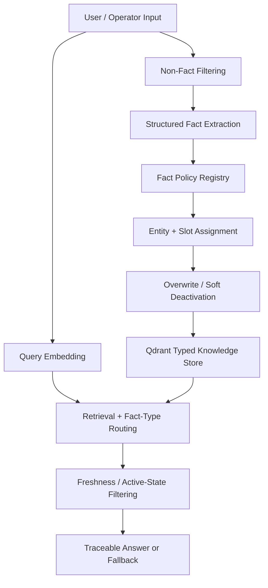

# Lifecycle-Aware AI Memory Layer for Retail Decision Support

This project began as a memory layer for an LLM-powered livestream commerce system.
It has now been extended into a SQL-assisted retail decision-support prototype
for multi-store Meituan instant-retail operations.

The system demonstrates how changing commercial information should be:
1. extracted into structured facts,
2. processed with SQL when it comes from store-level metrics,
3. converted into scoped operational memory,
4. retrieved with freshness, confidence, and source checks,
5. used conservatively for decision support instead of unsupported recommendations.

Meituan backend metrics
        ↓
        
Anonymized store-level CSV
        ↓
        
SQL derived metrics
        ↓
        
Cross-store tags and risk signals
        ↓
        
Generated operational memory facts
        ↓
        
Lifecycle-aware retrieval
        ↓
        
Traceable decision-support answer / conservative refusal


## 30-Second Summary

AI agents can produce fluent responses while still using outdated, conflicting, or weakly matched information. This project explores how to reduce that risk in a livestream and retail-commerce setting.

The system extracts structured product facts such as price, promotion, stock status, shipping policy, and product features; stores them as typed memory; applies freshness and overwrite rules; retrieves relevant facts with traceable sources; and falls back or returns a safe refusal when reliable memory is not available.

In simple terms, this project is not only about making an AI agent remember information. It is about making memory more reliable, updateable, inspectable, and safer to reuse when product information changes over time.

The project began from an earlier LLM-powered livestream system and later informed my interest in adapting structured retrieval from customer-facing product interaction to internal retail decision support.

For admissions review, this repository should be read together with my Meituan retail supplementary evidence. The supplementary evidence shows the real multi-store retail context; this repository shows the technical prototype behind my interest in structured memory, retrieval reliability, and AI-assisted decision support.


## Current Status

Status: working local prototype, tested through scenario-based evaluation.

- Local Docker Compose setup: FastAPI service + Ollama + Qdrant
- Structured fact extraction and typed memory
- Product-level entity separation
- Overwrite control and soft deactivation
- Freshness-aware retrieval design and active-state filtering
- Traceable retrieval outputs
- Scenario-based evaluation: 11 / 11 current cases passed
- Main endpoints: `/chat_mem` for fact ingestion and `/chat_livestream_kb` for structured retrieval

## Why This Matters

This project is not intended to be a general chatbot demo. It focuses on a practical reliability problem: how an AI system should manage changing commercial knowledge over time.

In retail and commerce settings, outdated or conflicting information can lead to wrong decisions or misleading responses. By adding structured memory, update policies, freshness filtering, and traceable retrieval, this project helped me understand how AI systems can be made more inspectable and more useful for decision support.

## Minimal Example

This example shows the core behavior of the memory layer in the simplest possible form.

**Input fact**

```text
A款价格是99元
```

**Stored structured memory**

```json
{
  "type": "product_price",
  "product_ref": "A款",
  "value": "99元",
  "slot": "price",
  "is_active": true
}
```

**Updated fact**

```text
A款价格是89元
```

**Expected behavior**

- The newer price becomes the active fact.
- The older price is preserved but softly deactivated.
- A later query such as `A款多少钱？` should retrieve the current active price.
- If no reliable active fact is available, the system should fall back or refuse instead of treating outdated memory as current knowledge.

## Admissions Demo Transcript

This simplified transcript shows the core behavior without requiring reviewers to run the code.

1. Store initial fact  
User input: `A款价格是99元`  
System extracts: `product_price = 99元`, entity = `A款`, active = true

2. Update the fact  
User input: `A款价格是89元`  
System behavior: the new price becomes active; the older price is softly deactivated.

3. Retrieve current information  
User query: `A款多少钱？`  
Expected behavior: retrieve the active price `89元` with traceable source information.

4. Unsupported or stale information  
User query: `今天有什么优惠？`  
Expected behavior: if no reliable active promotion fact is available, the system should fall back or refuse instead of inventing an answer.

## Architecture Overview



## Key Design Ideas

| Design choice | Problem it addresses | Why it matters |
|---|---|---|
| Structured fact extraction | Raw chat history is hard to update or verify | Converts interaction into explicit knowledge |
| Typed memory | Different information types behave differently | Price, promotion, stock, and product features need different rules |
| Entity + slot storage | Product facts can conflict across products | Prevents facts about different products from overwriting each other |
| Soft deactivation | Old facts should not disappear silently | Preserves traceability while keeping current knowledge active |
| Freshness filtering | Promotions and stock status become outdated quickly | Reduces the risk of using stale information |
| Retrieval gating | Similarity alone does not prove reliability | Prevents the system from using weakly matched memory as if it were verified knowledge |
| Traceable sources | Hidden memory use is hard to inspect | Makes answers easier to debug and evaluate |

## What This Demonstrates

This project demonstrates several abilities relevant to AI, data science, and language-technology-related study:

- identifying a real reliability problem in AI-assisted commerce
- representing unstructured interaction as structured data
- mapping short product-related queries into typed facts
- designing rules for different types of changing information
- managing current vs outdated knowledge over time
- using retrieval with confidence, freshness, and validity checks
- exposing supporting sources for inspection
- evaluating system behavior through scenario-based test cases
- connecting customer-facing AI interaction with broader retail decision support

## Quick Review Path

For admissions officer:

1. Read the 30-Second Summary to understand the project purpose.
2. See the Minimal Example to understand the core memory behavior.
3. See the Architecture Overview and Key Design Ideas for the system design.
4. See `eval/eval_report.md` for the current behavior-based evaluation.
5. See `retail_ops/README.md` for the SQL-based retail operations extension.
6. See `retail_ops/outputs/cross_store_comparison_report.md` for the cross-store Meituan metrics comparison report.
7. See `retail_ops/outputs/generated_memory_facts.json` for how SQL outputs are converted into structured operational memory facts.
8. See `PROJECT_SUMMARY_FOR_ADMISSIONS.md` for a concise application-oriented summary.
9. See `case_studies/from_livestream_to_retail_decision_support.md` for the broader narrative connection from livestream memory to retail decision support.

## Connection to Retail Decision Support

In the latest extension, I added a small SQL-based retail operations workflow under `retail_ops/`. This extension uses manually organized Meituan merchant backend metrics from five anonymized stores in March 2026 and calculates comparable cross-store indicators such as search visit share, search exposure-to-visit rate, refund pressure, subsidy intensity, and revenue per visitor.

This extension is not intended to claim automatic business optimization. Its purpose is to show how fragmented store-level operational metrics can be standardized, compared through SQL, and converted into structured memory facts with period, scope, confidence, and source information.

Although the prototype focuses on livestream and retail product interaction, the same memory-layer design can be extended to internal retail operations decision support.

In livestream commerce, product knowledge changes over time: prices are updated, promotions expire, stock status changes, and product features need to be retrieved accurately. In multi-store retail operations, a similar lifecycle problem appears in operational knowledge: pricing decisions change, inventory notes become outdated, promotion observations may only apply to specific periods, seasonal demand patterns vary by context, and SKU role classifications need to be reused carefully rather than blindly copied across stores.

This connection later informed my interest in adapting structured retrieval from a customer-facing product interaction setting into a broader decision-support setting for retail operations.

The key idea is the same: changing information should not be treated as timeless memory. It should be structured, updated, filtered, retrieved with traceable evidence, and reused only when it remains reliable.

In this sense, the project provides a technical bridge between AI-assisted product interaction and my later interest in data-informed retail decision support.

At the current stage, the retail extension should be understood as a data-readiness and conservative decision-memory prototype rather than a fully automated business optimization system. Its purpose is to show how fragmented store-level metrics can be structured, checked for comparability, and converted into traceable operational memory before being reused by an AI assistant.

## From Product Memory to Retail Decision Support

| Current memory type | Current livestream use | Retail decision-support extension |
|---|---|---|
| `product_price` | Retrieve current product price | Track pricing decisions and price-change context across stores |
| `promo` | Retrieve current promotion | Store promotion observations and avoid reusing expired campaign logic |
| `stock_status` | Retrieve whether a product is available | Track inventory notes, stockout risks, and replenishment decisions |
| `shipping_policy` | Retrieve delivery or shipping rule | Connect fulfillment constraints with store operation decisions |
| `product_feature` | Retrieve product selling points | Store SKU role, product positioning, and seasonal demand patterns |

# Retail Operations Data Readiness Extension

This folder extends the lifecycle-aware memory layer from livestream product facts to multi-store retail operations data.

The goal is not to claim that the system can already produce perfect business recommendations. In real Meituan operations, store-level backend data is fragmented, uneven, and difficult to compare directly. Some stores have high volume and stable metrics, while others have low order counts or incomplete indicators.

Therefore, this extension focuses on an earlier but important step: turning raw store-level data into structured, comparable, and traceable operational memory.

## What This Extension Demonstrates

1. A simple SQL schema for organizing multi-store operational metrics.
2. Data quality checks before comparing stores.
3. Conservative comparability screening.
4. Structured operational memory facts with time period, store scope, metric source, and confidence level.
5. A decision-support principle: the system should refuse or qualify recommendations when data is incomplete or not comparable.

## Why This Matters

Meituan merchant backend data is useful, but it is primarily store-centric. Cross-store comparison requires additional structure. Without this layer, an AI assistant may overgeneralize from one store, reuse outdated observations, or produce recommendations that are not supported by comparable data.

This extension shows how SQL-based data preparation and lifecycle-aware memory can work together before higher-level AI decision support.

## Current Capabilities

The current prototype supports:

- structured fact extraction from product-related interaction
- policy-driven typed memory through a centralized fact-policy registry
- product-level entity separation using `product_ref`, `entity_id`, and `slot`
- overwrite control and soft deactivation for updated single-value facts
- lifecycle metadata including timestamps, freshness windows, active-state flags, and last-seen signals
- traceable retrieval outputs
- fallback or refusal when no sufficiently reliable structured memory is available
- scenario-based evaluation covering routing, overwrite, entity separation, non-fact filtering, and fallback behavior

The project is intentionally compact. It focuses on memory behavior, reliability, update logic, and traceability rather than building a full production livestream platform.

## Example Workflows

### 1. Structured fact extraction from interaction

A livestream or product-related input can be converted into a structured fact instead of remaining only as raw chat history. For example, a message such as `A款价格是99元` can be stored as a typed fact like `product_price = 99元`, making it available for later retrieval and update handling.

### 2. Traceable typed retrieval

When the system answers a follow-up query, it can retrieve the relevant stored fact and surface the supporting memory entry rather than relying on hidden recall. For example, after storing `A款价格是99元`, a later query such as `A款多少钱` can be answered with traceable evidence showing which fact was used.

### 3. Overwrite and soft deactivation

If newer information of the same type appears, the system can update the active fact without discarding the older record entirely. For example, if `A款价格是99元` is later followed by `A款价格是89元`, the newer price can become active while the older one is preserved through soft deactivation for traceability.

### 4. Product-level separation

The system can separate facts across products instead of forcing all livestream knowledge into a single default product context. For example, `A款价格是99元` and `B款价格是199元` can be stored under different product entities, so that later retrieval and overwrite behavior remains product-specific.

### 5. Livestream commerce query routing

For livestream commerce queries, the system does not rely on a separate intent classifier. Instead, it performs semantic retrieval over eligible knowledge candidates, applies fact-type-specific validity checks and routing thresholds, and uses the highest-scoring eligible fact type among the top-k retrieval candidates as the routed type.

In other words, livestream fact-type routing is implemented through retrieval-time score competition rather than a standalone classification step.

Current examples include:

- `这款多少钱？` / “How much is this item?” → product price
- `今天有什么优惠？` / “What promotions are available today?” → promotions
- `现在有货吗？` / “Is it in stock now?” → stock status
- `多久能发货？` / “How long until it ships?” → shipping policy
- `这款有什么特点？` / “What are this product’s features?” → product features

### 6. Lifecycle-aware fallback and refusal

The system can also fall back or refuse when stored knowledge should no longer be used. This includes cases where a fact is stale, inactive, unsupported, or otherwise not reliable enough to support an answer. For example, an outdated promotion may still remain in storage for history tracking, but it can be filtered out or refused at answer time rather than being treated as current knowledge.

## Evaluation

This repository includes a scenario-based evaluation setup for the livestream knowledge and memory layer.

The evaluation does not benchmark the language model itself. Instead, it tests whether the memory layer behaves correctly in scenarios involving updated facts, product separation, non-fact filtering, unsupported queries, fallback behavior, and traceable retrieval.

Current evaluation result: **11 / 11 scenario-based cases passed.**

The current cases cover:

- product price retrieval
- price overwrite
- unsupported-query fallback
- product-level entity separation
- stock status retrieval
- stock overwrite
- promotion retrieval
- promotion overwrite
- shipping policy retrieval
- product feature retrieval
- non-fact filtering

Evaluation files:

- `eval/eval_livestream_cases.json` — scenario cases and expected outcomes
- `eval/eval_livestream.py` — lightweight evaluation runner
- `eval/eval_report.md` — evaluation scope, current results, limitations, and next steps
- `eval/results/eval_result_11_pass.txt` — saved run output

The main evaluation flow uses `/chat_mem` to ingest structured facts and `/chat_livestream_kb` to retrieve and answer from the structured livestream knowledge base.

## Running the Project

This project is intended to run locally with Docker Compose.

### Prerequisites

- Docker and Docker Compose
- Ollama-compatible local model setup
- Qdrant is started through Docker Compose
- Optional environment variables are documented in `.env.example`

The default Docker Compose setup can run with the provided defaults, but `.env.example` documents the main configurable values.

Optional environment variables are shown in `.env.example`.

Start the services with:

```bash
docker compose up -d
```

The local setup includes the API service, Ollama for local model inference and embeddings, and Qdrant for vector storage and typed memory retrieval.

You can check that the API is running with:

```bash
curl http://127.0.0.1:8000/health
```

If you update the API code, rebuild the API service with:

```bash
docker compose up -d --build api
```

## Running the Evaluation

The evaluation runner is designed to run against the local API service. It uses `/chat_mem` to ingest setup messages into the structured memory layer, and then uses `/chat_livestream_kb` to retrieve livestream knowledge and answer the final query.

Start the local services first:

```bash
docker compose up -d --build
```

Check that the API is running:

```bash
curl http://127.0.0.1:8000/health
```

Copy the evaluation folder into the API container and run the evaluation:

```bash
docker compose exec api rm -rf /app/eval
docker compose cp eval api:/app/eval
docker compose exec api python /app/eval/eval_livestream.py
```

The latest saved evaluation output is available at `eval/results/eval_result_11_pass.txt`.

## Repository Structure

- `api/main.py` — main FastAPI application, including memory logic, retrieval control, routing, overwrite behavior, and debug endpoints
- `api/Dockerfile` — Docker image definition for the API service
- `api/requirements.txt` — Python dependencies for the API service
- `docker-compose.yml` — local multi-service setup for the API, Ollama, and Qdrant
- `eval/eval_livestream_cases.json` — scenario-based evaluation cases and expected outcomes
- `eval/eval_livestream.py` — lightweight evaluation runner for the livestream memory cases
- `eval/eval_report.md` — evaluation scope, current result, limitations, and next steps
- `case_studies/from_livestream_to_retail_decision_support.md` — case study connecting the memory-layer design to retail operations decision support
- `PROJECT_SUMMARY_FOR_ADMISSIONS.md` — concise project summary for admissions review
- `ADMISSIONS_REVIEW_GUIDE.md` — short guide for reviewers who want to inspect the repository quickly
- `README.md` — project overview, capabilities, evaluation notes, and usage instructions

## Limitations and Design Trade-Offs

This repository reflects an ongoing iteration rather than a finished production system. The project is intentionally compact, and a number of design choices remain visible at the application level for ease of inspection and experimentation.

At the current stage, much of the logic still lives in a single main service file. This makes iteration easier during development and keeps policy, overwrite, routing, and retrieval behavior easy to inspect. As the project grows, a future version would likely separate extraction, routing, memory policy, evaluation, and storage logic into clearer modules.

The current evaluation is scenario-based and behavior-focused. It verifies important memory-layer behaviors such as overwrite, product separation, routing, and fallback, but it is not intended to be a broad benchmark of language-model capability.


## Next Steps

Short-term improvements:

- add timestamp-controlled freshness tests for stale promotion and outdated stock facts
- save machine-readable evaluation results after each run, in addition to the current text log
- add more ambiguous product-reference cases, such as similar product names or incomplete product mentions
- improve non-fact filtering cases beyond simple greetings

Medium-term improvements:

- separate extraction, routing, storage, lifecycle policy, and evaluation logic into clearer modules
- make the fact-policy registry easier to extend through configuration
- add a retail operations decision-support extension using anonymized or synthetic store metrics, aligned with my Meituan retail supplementary evidence
- explore how structured operational memory can support cross-store comparison and data-driven business decision-making


